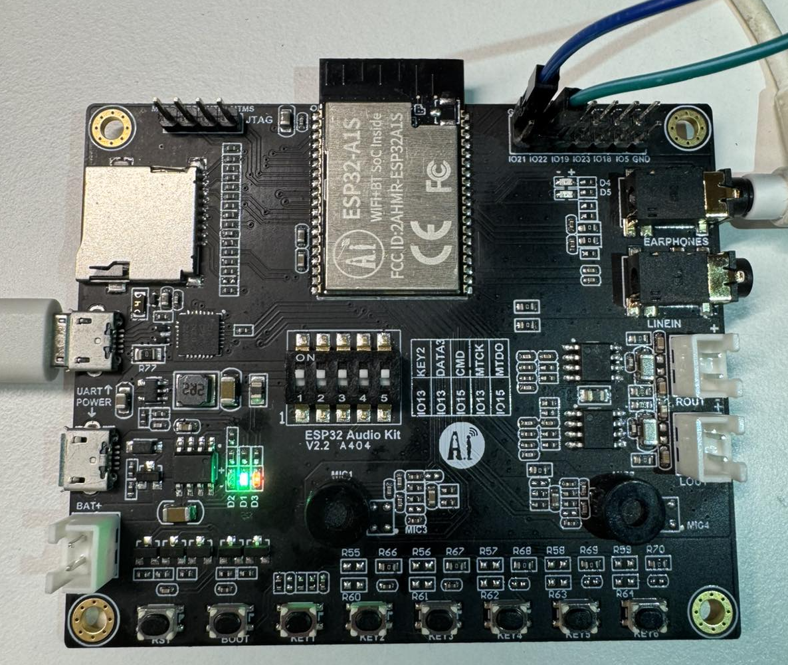
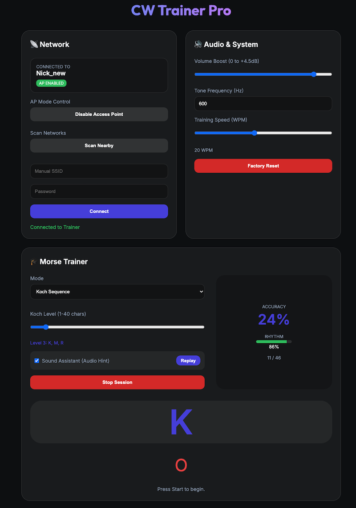

# 📻 CW Trainer Pro

**CW Trainer Pro** is a high-performance, web-enabled Morse code trainer built for the **ESP32 Audio Kit V2.2** (ES8388 codec). It features a modern web dashboard, real-time rhythm analysis, and support for the Koch training method.


## 📸 Interface

<p align="center">
  
  
</p>

## ✨ Features

- 🎹 **Dual Key Support**: Use on-board tactile buttons or connect an external straight key.
- 🎓 **Koch Method Trainer**: Master Morse code systematically with progressive character levels.
- 🎯 **Rhythm Analysis**: Real-time scoring of your sending accuracy and timing via WebSockets.
- 🌐 **Modern Web Dashboard**: Sleek, glassmorphic UI for settings, training, and live decoding.
- 🔊 **High-Quality Audio**: Uses the ES8388 dedicated audio codec for crystal clear sidetone.
- 📡 **Flexible Networking**: Works in both Station (connecting to your WiFi) and Access Point modes.
- 💾 **Persistent Settings**: Your WPM, volume, and frequency settings are saved to NVS automatically.

## 🛠️ Hardware Requirements

- **Development Board**: ESP32 Audio Kit V2.2 A404 (with ESP32-A1S module).
- **Audio Codec**: ES8388 (standard on this board).
- **Connectivity**: Micro-USB for power/programming, 3.5mm jack for headphones/speakers.

### Pinout (Standard Audio Kit V2.2)

| Component | Pin | Function |
|-----------|-----|----------|
| **KEY 1**   | GPIO 36 | Straight Key / Morse Input |
| **KEY 3**   | GPIO 19 | Frequency Down |
| **KEY 4**   | GPIO 23 | Frequency Up |
| **KEY 5**   | GPIO 18 | Volume Down |
| **KEY 6**   | GPIO 5  | Volume Up |
| **EXT KEY** | GPIO 22 | External Key Header |

## 🚀 Getting Started

### Prerequisites

- **ESP-IDF v5.4.1** (or compatible v5.x)
- `idf.py` command-line tool installed and configured.

### 🛠️ Setup & Build

1. **Clone the repository**:
   ```bash
   git clone https://github.com/yourusername/cw_trainer.git
   cd cw_trainer
   ```

2. **Set up the environment**:
   (Make sure you've installed ESP-IDF and run the install script)
   ```bash
   # On macOS/Linux:
   . $HOME/esp/esp-idf/export.sh
   ```

3. **Set the target chip**:
   The ESP32 Audio Kit V2.2 uses the standard ESP32 (WROVER-B / A1S module).
   ```bash
   idf.py set-target esp32
   ```

4. **Build the project**:
   This will download dependencies (via IDF Component Manager) and compile the source code.
   ```bash
   idf.py build
   ```

### ⚡ Flashing & Monitoring

1. **Pre-built Binaries**:
   Check the [Releases](https://github.com/yourusername/cw_trainer/releases) page for pre-compiled binaries (`.bin`) for every tagged version.

2. **Flash from Release (No ESP-IDF required)**:
   If you've downloaded the binaries from a release, you can flash them using `esptool.py` (requires Python):
   ```bash
   pip install esptool
   esptool.py --chip esp32 --port /dev/tty.usbserial-XXXX --baud 460800 \
     --before default_reset --after hard_reset write_flash -z \
     0x1000 bootloader.bin \
     0x8000 partition-table.bin \
     0x10000 cw_trainer.bin
   ```
   *Note: Replace `/dev/tty.usbserial-XXXX` with your actual port.*

3. **Flash to the board (With ESP-IDF)**:
   Connect your ESP32 Audio Kit via USB and run:
   ```bash
   idf.py flash
   ```

2. **Monitor output**:
   To see the serial logs (including the I2C scan and WiFi status), run:
   ```bash
   idf.py monitor
   ```
   *Tip: You can combine these commands: `idf.py flash monitor`*

## 📖 Usage

1. **Connect to WiFi**: 
   - On first boot, the device starts an Access Point named `CW-Trainer-XXXX`.
   - Connect to it and navigate to `http://cw-trainer.local/` in your browser.
2. **Training**:
   - Choose **Koch Sequence** to learn new characters.
   - Choose **Single Character** to practice specific ones.
   - Use **Sound Assistant** for audio prompts before you type.
3. **Hardware Keys**:
   - **KEY1**: Send Morse code manually.
   - **KEY3/4**: Adjust Tone Frequency.
   - **KEY5/6**: Adjust Volume.

## 🤝 Contributing

Contributions are welcome! Please feel free to submit a Pull Request. For major changes, please open an issue first to discuss what you would like to change.

## 📜 License

This project is licensed under the MIT License - see the [LICENSE](LICENSE) file for details.

---
*Built with ❤️ for the Amateur Radio community.*
